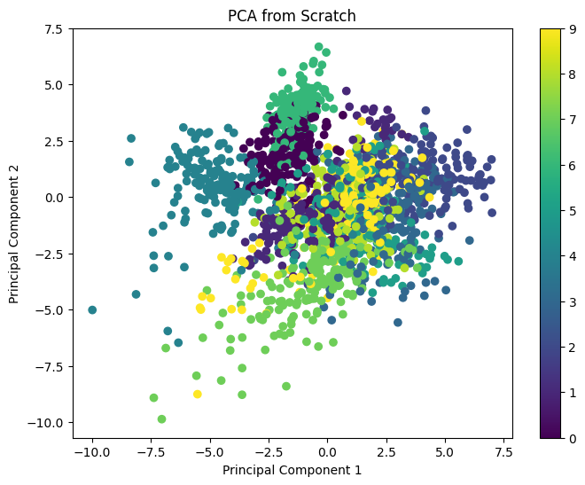

# PCA from Scratch in Python

This project demonstrates the implementation of Principal Component Analysis (PCA) from scratch using Python, NumPy, and Matplotlib. The objective of this project is to understand the mathematical concepts behind PCA and reproduce the dimensionality reduction process without using any built-in PCA libraries.

---

## 📌 About PCA

Principal Component Analysis (PCA) is a dimensionality reduction technique used to reduce the number of features in a dataset while preserving as much information as possible.

PCA transforms high-dimensional data into a lower-dimensional space by finding the directions (principal components) that maximize the variance in the data.

---
<p align="center">
  
</p>

<p align="center">
  PCA visualization of the digits dataset after dimensionality reduction
</p>

# PCA from Scratch in Python

## 🎯 Objective

The objectives of this project are:

- Understand the mathematics behind PCA.
- Compute the covariance matrix.
- Find eigenvalues and eigenvectors.
- Select the principal components.
- Reduce the dimensionality of the dataset.
- Visualize the transformed data.

---

## 📂 Dataset

This project uses the **Digits dataset** from `scikit-learn`.

Dataset information:

- Total samples: **1797**
- Number of features: **64**
- Number of classes: **10 (digits 0–9)**

Each image has dimensions:

```text
8 × 8 = 64 pixels
```

---

## 🛠️ Libraries Used

- NumPy
- Matplotlib
- Scikit-learn

Install the required libraries:

```bash
pip install numpy matplotlib scikit-learn
```

---

## 📋 Steps Involved

### Step 1: Load the dataset

```python
data = load_digits()

X = data.data
y = data.target
```

---

### Step 2: Standardize the data

```python
mean = np.mean(X, axis=0)

std = np.std(X, axis=0)

std[std == 0] = 1

X_standard = (X - mean) / std
```

---

### Step 3: Compute the covariance matrix

```python
cov_matrix = np.cov(X_standard.T)
```

---

### Step 4: Find eigenvalues and eigenvectors

```python
eigenvalues, eigenvectors = np.linalg.eig(cov_matrix)
```

---

### Step 5: Sort eigenvalues and eigenvectors

```python
sorted_index = np.argsort(eigenvalues)[::-1]

sorted_eigenvalues = eigenvalues[sorted_index]

sorted_eigenvectors = eigenvectors[:, sorted_index]
```

---

### Step 6: Select the principal components

```python
k = 2

principal_components = sorted_eigenvectors[:, :k]
```

---

### Step 7: Transform the data

```python
X_pca = np.dot(X_standard, principal_components)
```

---

### Step 8: Visualize the result

```python
plt.scatter(
    X_pca[:, 0],
    X_pca[:, 1],
    c=y,
    cmap="viridis"
)

plt.show()
```

---

## 📊 Results

Original dataset shape:

```text
(1797, 64)
```

Reduced dataset shape:

```text
(1797, 2)
```

PCA successfully reduced the dimensionality from **64 features to 2 features** while preserving the important information in the dataset.

---

## 📈 Output

The following scatter plot represents the transformed data in two dimensions.

- X-axis: Principal Component 1
- Y-axis: Principal Component 2
- Different colors represent different digits
images/output.png

---

## 📁 Project Structure

```text
PCA-from-Scratch/

│── pca.ipynb
│── pca.py
│── README.md
│── images/
```

---

## ▶️ How to Run

Clone the repository:

```bash
git clone https://github.com/your-username/PCA-from-Scratch.git
```

Go to the project folder:

```bash
cd PCA-from-Scratch
```

Install the required libraries:

```bash
pip install numpy matplotlib scikit-learn
```

Run the notebook:

```bash
jupyter notebook
```

or run the Python file:

```bash
python pca.py
```

---

## 🧠 Key Concepts Learned

- Data standardization
- Covariance matrix
- Eigenvalues and eigenvectors
- Principal components
- Dimensionality reduction
- Data visualization

---

## 📚 References

Inspired by:

https://github.com/redwankarimsony/PCA-from-Scratch-in-Python

Scikit-learn documentation:

https://scikit-learn.org/stable/modules/generated/sklearn.datasets.load_digits.html

---

## 👨‍💻 Author

Garikapati Sai Lokesh

B.Tech Robotics and Artificial Intelligence

Amrita Vishwa Vidyapeetham, Chennai